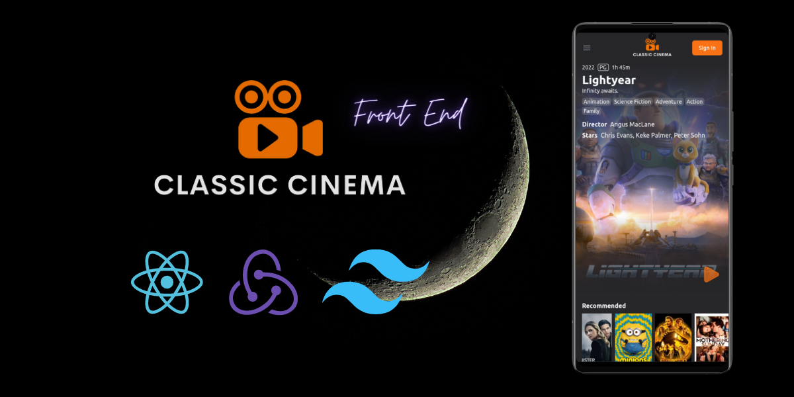

# Classic Cinema - Frontend

**Classic Cinema** is a movie catalog with social network features.

The current repository is the **frontend**. You can find the **backend** project in [this repository](https://github.com/matiasjaliff/classic-cinema-api). Although the **backend** is finished, I am currently working in the **frontend**. So, I will share the updates and announce when it's deployed.

## The App

I developed this app inspired by [Letterboxd](https://letterboxd.com/), a social platform for sharing film opinions and reviews. You will be able to search movies and receive recommendations, mark those movies you liked and follow other users and see what they recommend.

It has a mobile first design; I am currently working on responsiveness for other screen sizes and orientations.

## Technologies

🖱 **Front-end:** React, Redux, Tailwind.

⚙️ **Back-end:** Node, Express, PostgreSQL, Sequelize, JWT.

🛠 **Other:** [Mockplus RP](https://rp.mockplus.com/) for UI prototyping and [Lucidchart](https://www.lucidchart.com/pages/es) for database ERD.

## To Do
- User management views.
- Responsive for all devices.
- PWA implementation.